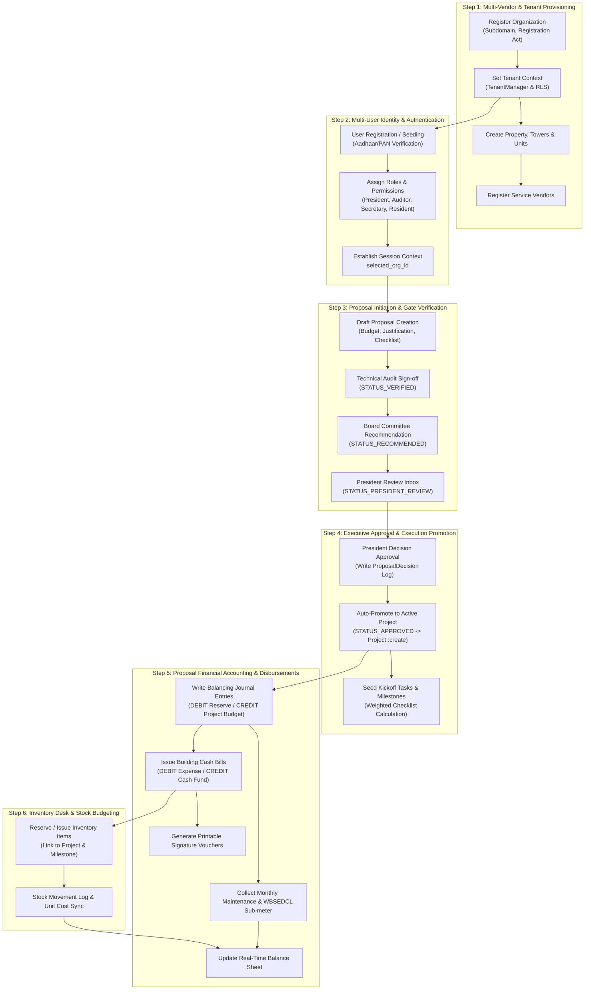

# BPDES (Narmada) - Full Project Present Status & Technical Documentation

> **System Name:** Building Project & Development Execution System (BPDES / Narmada)  
> **Architecture:** Multi-Tenant Enterprise SaaS with Database Row-Level Security (RLS)  
> **Core Framework:** Laravel 11.x, Livewire 3.x, PostgreSQL 15+ (with SQLite fallback support)  
> **Document Version:** 1.0.0  
> **Last Updated:** September 10, 2026  

---

## 1. Executive Summary & Architecture Overview

**BPDES (Narmada)** is an enterprise-grade, multi-tenant digital management platform engineered for Co-Operative Housing Societies, Apartment Owners Associations (AOA), Multi-Vendor Estates, and Commercial Property Complexes. The application enforces strict organizational isolation, dynamic multi-user role access, rigorous proposal verification workflows, double-entry financial accounting, maintenance and sub-meter utility billing engines, and real-time inventory and asset management.

### Key Architectural Pillars
- **Multi-Tenant Data Isolation:** Powered by custom PostgreSQL Row-Level Security (RLS) policies (`current_org_id()`), Laravel Global Eloquent Scopes (`TenantScope`), and runtime tenant resolution via `TenantManager`.
- **Reactive UI Workspaces:** Built using Livewire 3 SPA components (`ControlCenter`, `PresidentInbox`, `SuperadminDashboard`, `ResidentDashboard`, `OrganizationCrud`, `ProfileSettings`).
- **Transactional Outbox Pattern:** Ensures reliable domain event broadcasting and idempotent queue execution via the `outbox_events` table.
- **Double-Entry Financial Accounting:** Every monetary motion (project budget allocation, cash release bill, maintenance collection) generates balancing `DEBIT` and `CREDIT` records in `finance_journal_entries` and `transactions`.
- **Integrated Inventory & Stock Budgeting:** Synchronizes material purchases, stock issues, reserved allocations, and unit cost adjustments directly with active development projects and financial balance sheets.

---

## 2. Current Project Present Status

The repository is fully implemented, configured, and tested. The core modules and Livewire workspaces are active with auto-seeding protocols for immediate local development and staging environments.

### 2.1 Component Health & Implementation Matrix

| Module / Component | Implementation Status | Data Models / Schema | Primary UI Controller / Trait | Verification & Testing |
| :--- | :---: | :--- | :--- | :---: |
| **Tenant Identity & Organization** | **100% Operational** | `Organization`, `User`, `Role`, `Permission` | `SuperadminDashboard`, `OrganizationCrud` | `BpdesWorkflowTest` |
| **Premises & Resident Registry** | **100% Operational** | `Property`, `Building`, `Unit`, `Person`, `Membership`, `Nominee` | `ControlCenter` (Tabs 2 & 3), `Register` | `MaintenanceContributionTest` |
| **Governance & Authority** | **100% Operational** | `CommitteeAppointment`, `Document`, `Meeting`, `Resolution` | `ControlCenter` (Tabs 4 & 5) | Verified |
| **Proposal & Verification Pipeline** | **100% Operational** | `Proposal`, `ProposalDecision` | `ControlCenter` (Overview), `PresidentInbox` | `BpdesWorkflowTest` |
| **Project & Task Execution** | **100% Operational** | `Project`, `ProjectMilestone`, `Task` | `PresidentInbox`, `ControlCenter` | `BpdesWorkflowTest` |
| **Double-Entry Accounting** | **100% Operational** | `JournalEntry`, `Transaction`, `LedgerAccount`, `BankAccount` | `HandlesBalanceSheet` trait | `InventoryAndBalanceSheetTest` |
| **Cash Release & Voucher Engine** | **100% Operational** | `BuildingCashBill` | `HandlesCashReleaseBills` trait | `BuildingCashBillTest` |
| **Maintenance & Utility Billing** | **100% Operational** | `MaintenanceEntry`, `ElectricityBill` | `HandlesMaintenanceEntries` trait | `MaintenanceContributionTest` |
| **Inventory & Asset Desk** | **100% Operational** | `InventoryItem`, `InventoryTransaction`, `Asset` | `HandlesInventoryDesk` trait | `InventoryAndBalanceSheetTest` |
| **Real-Time Balance Sheet** | **100% Operational** | Aggregation Engine | `HandlesBalanceSheet` trait | `InventoryAndBalanceSheetTest` |

---

## 3. Step-by-Step Module Propagation Pipeline

The following section outlines the end-to-end operational propagation workflow of the application, tracing data and control flow step-by-step.



---

### Step 1: Organization Multi-Vendor & Tenant Provisioning

1. **Organization Registration:**
   - Superadmin registers a new organization (e.g., *Royal Palm Co-Operative Society*) specifying registration authority, registration act (e.g., *West Bengal Apartment Ownership Act, 1972*), GSTIN, PAN, and a unique subdomain slug.
   - Database record created in `organizations` with default settings JSON.

2. **Database Row-Level Security (RLS) Setup:**
   - When a tenant context is activated, `TenantManager::setTenantId($orgId)` executes:
     ```sql
     SET app.current_org_id = 'org-uuid-here';
     ```
   - PostgreSQL RLS policy filters all queries seamlessly:
     ```sql
     CREATE POLICY users_isolation ON users USING (organization_id = current_org_id());
     ```
   - Non-Postgres environments (e.g. SQLite testing) rely on Eloquent's `TenantScope` global scope and `BelongsToTenant` trait.

3. **Premises & Vendor Infrastructure:**
   - Physical premises registered under the tenant (`properties` ➔ `buildings` ➔ `units`).
   - Third-party contractors registered in `vendors` with PAN, GSTIN, and service category (Plumbing, Elevator, Security, Waterproofing).

---

### Step 2: Multi-User Identity & Scoped Authentication

1. **User Role Hierarchy:**
   - **Superadmin:** Global system administrator; manages multi-tenant organizations and system-wide roles.
   - **President:** Executive board authority; reviews recommended proposals, issues binding approvals/rejections, and authorizes financial disbursements.
   - **Auditor / Technical Verifier:** Inspects proposals, verifies structural/legal checklists, and grants technical sign-off.
   - **Secretary:** Manages day-to-day administration, committee appointments, and document vault.
   - **Treasurer / Cashier:** Oversees cash release bills, maintenance collections, and voucher printing.
   - **Resident:** Unit owners and tenants; views personal maintenance invoices, payment receipts, and sub-meter electricity breakdowns.

2. **Verification ID Rules Engine:**
   - Resident registration (`app/Livewire/Auth/Register.php` and `ControlCenter.php`) enforces strict regex validation:
     - **Aadhaar:** `^\d{4}-\d{4}-\d{4}$|^\d{12}$`
     - **PAN:** `^[A-Z]{5}[0-9]{4}[A-Z]{1}$`
     - **Voter ID:** `^[A-Z]{3}[0-9]{7}$`
     - **Passport:** `^[A-Z][0-9]{7}$`

3. **Session Context Resolution:**
   - Upon successful login via `app/Livewire/Auth/Login.php`, `session(['selected_org_id' => $user->organization_id])` is established, anchoring all subsequent Livewire calls to the target organization.

---

### Step 3: Proposal Pipeline & Dynamic Gate Verification

A proposal transitions through 7 distinct lifecycle stages:

```
[DRAFT] ➔ [SUBMITTED] ➔ [VERIFICATION] ➔ [VERIFIED] ➔ [COMMITTEE_REVIEW] ➔ [RECOMMENDED] ➔ [PRESIDENT_REVIEW] ➔ [APPROVED / REJECTED / DEFERRED]
```

1. **Proposal Creation:**
   - Created in `ControlCenter.php` with title, detailed description, budget allocation, execution date, deadline, justification text, and optional technical attachment (`document_path`).
   - Automatically assigned a dynamic verification checklist (e.g., *Structural load audit*, *Municipal permissions*, *Vendor quotation comparison*).

2. **Technical Audit Sign-off:**
   - Verifier checks technical checklist items in `ControlCenter.php`.
   - Executes `verifyProposal($id)`: Status advances `VERIFICATION` ➔ `VERIFIED`.

3. **Board Committee Recommendation:**
   - Executes `forwardToCommittee($id)`: Status advances `VERIFIED` ➔ `COMMITTEE_REVIEW`.
   - Executes `recommendProposal($id)`: Status advances `COMMITTEE_REVIEW` ➔ `RECOMMENDED`.
   - Executes `sendToPresident($id)`: Status advances `RECOMMENDED` ➔ `PRESIDENT_REVIEW`.

---

### Step 4: Executive Approval & Execution Promotion

1. **President Review Inbox:**
   - proposals in `STATUS_PRESIDENT_REVIEW` appear in `PresidentInbox.php`.
   - President inspects full proposal justification, checklist status, and budget impact.

2. **Atomic State Conversion Transaction:**
   - When President selects `APPROVED`, `PresidentInbox::submitDecision()` runs inside a database transaction:
     ```php
     DB::transaction(function () use ($proposal, $user) {
         // 1. Audit Decision Record
         ProposalDecision::create([
             'proposal_id' => $proposal->id,
             'decided_by' => $user->id,
             'decision' => 'APPROVED',
             'remarks' => $this->remarks,
         ]);

         // 2. State Transition
         $proposal->transitionTo(Proposal::STATUS_APPROVED);

         // 3. Promote to Project
         $project = Project::create([
             'proposal_id' => $proposal->id,
             'title' => $proposal->title,
             'description' => $proposal->description,
             'budget' => $proposal->budget,
             'status' => 'Planning',
             'start_date' => now(),
             'end_date' => now()->addDays(30),
         ]);

         // 4. Seed Tasks & Milestones
         Task::create(['project_id' => $project->id, 'title' => 'Project Kickoff & Vendor Finalisation', ...]);
         ProjectMilestone::create(['project_id' => $project->id, 'title' => 'Phase 1: Materials Procurement', ...]);

         // 5. Double-Entry Accounting Journal Entries
         JournalEntry::create(['type' => 'DEBIT', 'account_name' => 'General Reserve Fund', 'amount' => $proposal->budget, ...]);
         JournalEntry::create(['type' => 'CREDIT', 'account_name' => "Project Budget Account: {$project->title}", 'amount' => $proposal->budget, ...]);
     });
     ```

3. **Milestone Checklist Weightage Progress:**
   - Milestones maintain fixed task weightages summing to 100%. Toggling tasks automatically recalculates progress:
     $$\text{Progress \%} = \sum_{\text{completed}} \text{Weightage}_i$$
   - Status automatically shifts from `PENDING` ➔ `IN_PROGRESS` ➔ `COMPLETED`.

---

### Step 5: Proposal Financial Accounting & Disbursements

1. **Double-Entry Accounting Ledger:**
   - Every transaction balances debits and credits:
     - **Project Promotion:** `DEBIT` Reserve Fund / `CREDIT` Project Budget.
     - **Cash Disbursement:** `DEBIT` Building Expense Account / `CREDIT` Main Cash Collection Fund.
     - **Maintenance Collection:** `DEBIT` Cash/Bank / `CREDIT` Maintenance Revenue Account.

2. **Cash Release Desk (`BuildingCashBill`):**
   - 3-step wizard in `HandlesCashReleaseBills.php` captures voucher number, category, amount, responsible person, linked proposal/project/milestone, and receipt upload.
   - Automatically generates a **Printable Signature Voucher** featuring formal signature blocks for Treasurer, President, and Receiver.

3. **WBSEDCL Sub-meter Electricity Billing Engine:**
   - Implements official West Bengal State Electricity Distribution Company Limited (WBSEDCL) bill breakdown mathematics:
     $$\text{Gross Bill} = \text{Energy Charge} + \text{Duty} + \text{Fixed Charge} + \text{Meter Rent} - \text{LPSC}$$
     $$\text{Recommended Unit Rate} = \frac{\text{Energy Charge} + \text{Duty}}{\text{Common Meter Units}}$$
     $$\text{Personal Charge} = \text{Units Consumed} \times \text{Recommended Unit Rate}$$
     $$\text{Common Share Per Flat} = \frac{\text{Gross Bill} - \text{Personal Charge}}{\text{Total Flats Count}}$$
     $$\text{Total Payable} = \text{Personal Charge} + \text{Common Share Per Flat}$$

4. **Real-Time Balance Sheet Generator (`HandlesBalanceSheet.php`):**
   - Dynamically aggregates:
     - **Current Assets:** Cash in Hand, Bank Balances, Inventory Valuation ($\sum \text{Stock} \times \text{Unit Cost}$), Outstanding Maintenance Receivables.
     - **Fixed Assets:** Active Plant, Machinery, Lifts & Generator Valuation.
     - **Current Liabilities:** Unpaid Cash Bills, Advance Member Collections.
     - **Reserves:** Sinking Fund Reserve (18% of Assets), General Reserve Fund (12% of Assets).
     - **Capital Equity:** Accumulated Surplus balancing item.
   - Validates accounting equation: $\text{Total Assets} = \text{Total Liabilities} + \text{Total Equity}$.

---

### Step 6: Inventory Desk & Stock Budgeting Integration

1. **Stock Item Tracking:**
   - Items stored with SKU, category, unit, minimum stock trigger level, stock quantity, reserved quantity, unit cost, allocated budget, and storage location.

2. **Stock Movement Types:**
   - **`Purchase` (Stock IN):** Increments stock quantity and updates unit cost.
   - **`Issue` (Stock OUT):** Decrements available stock quantity; logs reference ID to Project or Task.
   - **`Reserve`:** Reserves material quantity for an approved proposal/project and allocates dedicated budget without removing physical stock until execution.
   - **`Adjustment`:** Calibrates stock levels during physical audits.

3. **Financial Valuation Link:**
   - Total inventory stock value ($\sum \text{stock\_quantity} \times \text{unit\_cost}$) flows directly into the Current Assets section of the Balance Sheet.

---

## 4. Entity-Relationship Schema

```mermaid
erDiagram
    ORGANIZATION ||--o{ USER : "has users"
    ORGANIZATION ||--o{ PROPERTY : "owns properties"
    PROPERTY ||--o{ BUILDING : "contains towers"
    BUILDING ||--o{ UNIT : "contains flats"
    UNIT ||--o{ MEMBERSHIP : "mapped via"
    PERSON ||--o{ MEMBERSHIP : "holds"
    
    ORGANIZATION ||--o{ PROPOSAL : "initiates"
    USER ||--o{ PROPOSAL : "creates"
    PROPOSAL ||--o{ PROPOSAL_DECISION : "audited by"
    PROPOSAL ||--o? PROJECT : "promotes to"
    PROJECT ||--o{ PROJECT_MILESTONE : "divided into"
    PROJECT ||--o{ TASK : "executes via"
    
    ORGANIZATION ||--o{ JOURNAL_ENTRY : "records ledger"
    ORGANIZATION ||--o{ BUILDING_CASH_BILL : "disburses cash"
    ORGANIZATION ||--o{ MAINTENANCE_ENTRY : "bills maintenance"
    ORGANIZATION ||--o{ ELECTRICITY_BILL : "bills submeter"
    
    ORGANIZATION ||--o{ INVENTORY_ITEM : "stores inventory"
    INVENTORY_ITEM ||--o{ INVENTORY_TRANSACTION : "logs movements"
    PROJECT ||--o{ INVENTORY_TRANSACTION : "consumes stock"
```

---

## 5. System Verification & Test Suite Strategy

The repository features comprehensive automated test coverage enforcing multi-tenancy isolation and end-to-end business workflows.

### 5.1 Test Suite Summary (`tests/Feature/`)

- **`BpdesWorkflowTest.php`:**
  - Tests full proposal lifecycle from `DRAFT` ➔ `VERIFICATION` ➔ `PRESIDENT_REVIEW` ➔ `APPROVED`.
  - Verifies automatic promotion to `Project`, kickoff `Task` creation, and double-entry `JournalEntry` ledger balancing.
  - Verifies database tenant isolation between Tenant A and Tenant B.
- **`BuildingCashBillTest.php`:**
  - Tests cash release bill creation, voucher number generation, responsible person assignment, and journal entry generation.
- **`MaintenanceContributionTest.php`:**
  - Tests batch monthly maintenance creation across flats, payment recording, outstanding balance synchronization, and invoice printing.
- **`InventoryAndBalanceSheetTest.php`:**
  - Tests stock movements (`Purchase`, `Issue`, `Reserve`, `Adjustment`), low stock alerts, inventory valuation, and real-time Balance Sheet balancing.

---

## 6. Maintenance & Deployment Operations

### 6.1 Database Migration & Seeding
To initialize the database schema and default seeds:
```bash
php artisan migrate:fresh --seed
```

### 6.2 Running Automated Test Suite
To run all automated feature and unit tests:
```bash
php artisan test
```

### 6.3 Local Development Server
To launch the application server:
```bash
php artisan serve
```

---
*Documentation maintained by the BPDES Engineering Core Team.*
